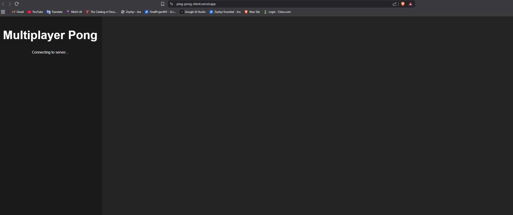
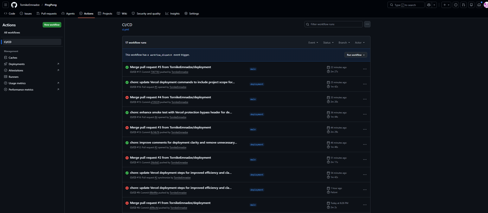
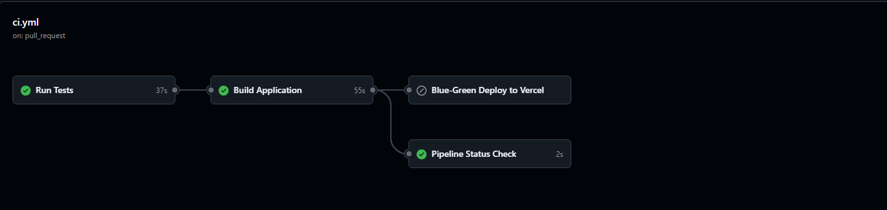
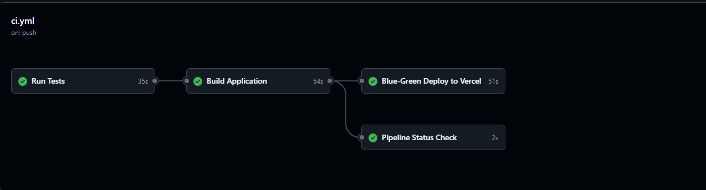
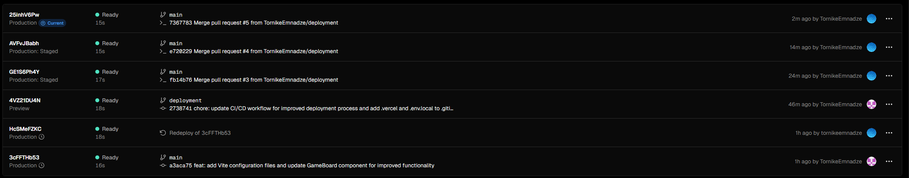
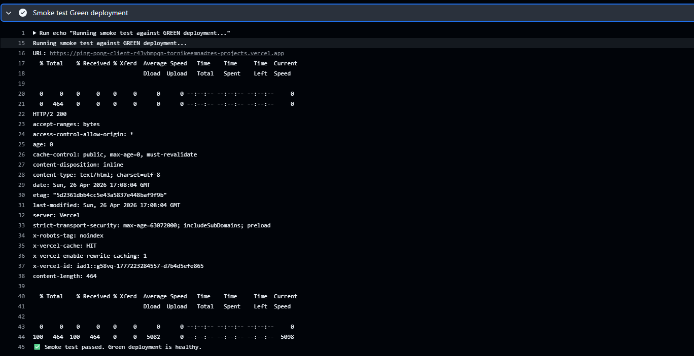

# Multiplayer Pong — CI/CD Pipeline Automation & Deployment Strategies

## Live Application

**Live Application URL:**  
https://ping-pong-client.vercel.app/

> Note: The frontend is deployed on Vercel for this assignment. The backend Socket.IO server is included in the repository and is tested/built in the CI pipeline, but it is not deployed to Vercel because the backend requires a long-running WebSocket server. Vercel is used here for the frontend deployment and CI/CD release workflow.

---

## Project Overview

This project is a simple Multiplayer Pong application built with a React/Vite frontend and a Node.js/Express backend.

The main goal of this assignment is not the complexity of the application itself, but the automation of the delivery process. The project demonstrates a complete CI/CD workflow where code is tested, built, deployed, smoke-tested, and promoted to production using GitHub Actions and Vercel.

The repository contains:

- A React/Vite frontend located in the `client` folder
- A Node.js/Express backend located in the `server` folder
- Automated frontend tests using Vitest
- Automated backend tests using Jest
- A GitHub Actions workflow for CI/CD automation
- A Vercel deployment setup for hosting the frontend
- A Blue-Green deployment strategy using staged Vercel production deployments

---

## Screenshots

### Hosted Application



### Successful GitHub Actions Run



The workflow history shows multiple pipeline runs during setup and debugging. The final run completed successfully, proving that the CI/CD pipeline is working correctly. For pull requests, the pipeline validates whether the changes are safe to merge into `main`. After the changes reach `main`, the pipeline runs again and deploys the application only if all CI checks pass.

### GitHub Actions Jobs




### Vercel Current Production Deployment



### Blue-Green Promotion / Smoke Test Logs



---

## CI/CD Pipeline Description

The project uses **GitHub Actions** as the CI/CD automation tool.

The workflow is triggered on:

- Every push to the `main` branch
- Every pull request targeting the `main` branch
- Manual workflow dispatch

The pipeline is structured into the following jobs:

1. **Run Tests**
2. **Build Application**
3. **Blue-Green Deploy to Vercel**
4. **Pipeline Status Check**

The deployment job only runs when code is pushed or merged into the `main` branch. Pull requests run the test and build stages, but they do not trigger deployment.

This means that deployment only happens after the code has passed the CI quality gate and has been merged into the main production branch.

---

## CI Quality Gate

The CI stage acts as a quality gate before deployment.

The pipeline first installs dependencies and runs automated checks for both the frontend and backend.

### Frontend Checks

The frontend CI steps include:

```bash
npm ci
npm run lint
npm test -- --run
npm run build
```

These steps validate that the frontend dependencies install correctly, the code follows linting rules, the test suite passes, and the production build succeeds.

### Backend Checks

The backend CI steps include:

```bash
npm ci
npm test -- --coverage
npm run build
```

These steps validate that the backend dependencies install correctly, the Jest test suite passes, test coverage is generated, and the TypeScript backend builds successfully.

If any test, lint, or build step fails, the pipeline stops and the deployment job is not executed.

---

## Continuous Deployment

The frontend is deployed to Vercel using the Vercel CLI from inside the GitHub Actions workflow.

Vercel automatic Git deployments were disabled so that deployment is controlled only by GitHub Actions. This ensures that the application is deployed only after the CI pipeline succeeds.

The deployment job depends on the build job:

```yaml
needs: build
```

The build job depends on the test job:

```yaml
needs: test
```

Because of this dependency chain, the deployment flow is:

**Run Tests → Build Application → Deploy Green Environment → Smoke Test → Promote to Production**

If tests fail, the build does not run.
If the build fails, deployment does not run.
If the smoke test fails, the new deployment is not promoted to production.

---

## Deployment Strategy: Blue-Green Deployment

The selected deployment strategy for this project is **Blue-Green Deployment**.

In this setup:

- **Blue** represents the currently live production deployment.
- **Green** represents the new deployment created from the latest successful build.

When code is merged into the main branch, GitHub Actions creates a new Vercel production deployment without immediately switching live traffic to it. This new deployment is treated as the Green environment.

After the Green deployment is created, the workflow runs a smoke test against the Green deployment URL.

If the smoke test succeeds, the pipeline promotes the Green deployment to production. At that point, the Green deployment becomes the new live production deployment, and the previous production deployment becomes the rollback target.

This approach reduces release risk because users continue using the previous stable production deployment until the new version has been successfully deployed and verified.

### Blue-Green Deployment Steps

The Blue-Green process works as follows:

1. A pull request is opened against main.
2. GitHub Actions runs tests, linting, and build validation.
3. The pull request cannot be safely merged unless the pipeline succeeds.
4. After the pull request is merged into main, the pipeline runs again.
5. The deployment job creates a new Vercel deployment as the Green environment.
6. The Green deployment is smoke-tested using curl.
7. If the smoke test passes, the Green deployment is promoted to production.
8. The promoted Green deployment becomes the current live production version.

---

## Smoke Testing

After deployment, the pipeline performs a smoke test against the newly created Green deployment.

The smoke test checks that the deployment URL responds successfully before production traffic is switched to it.

The smoke test uses the Vercel automation bypass header because Vercel deployment protection may block automated requests:

```bash
curl -f \
  -H "x-vercel-protection-bypass: $VERCEL_AUTOMATION_BYPASS_SECRET" \
  "$DEPLOYMENT_URL"
```

If the smoke test fails, the pipeline stops and the Green deployment is not promoted to production.

---

## Rollback Guide

If a bug is discovered in production, the application can be rolled back to the previous stable Vercel deployment.

### Rollback Using the Vercel Dashboard

1. Open the Vercel dashboard.
2. Select the ping-pong-client project.
3. Go to the Deployments tab.
4. Find the previous stable production deployment.
5. Open the deployment options menu.
6. Choose Promote to Production or Rollback, depending on the available Vercel option.
7. Confirm the rollback.
8. Open the live application URL and verify that the previous stable version is restored.
9. Re-run smoke testing manually against the production URL.

### Rollback Using the Vercel CLI

A rollback can also be performed with the Vercel CLI:

```bash
vercel rollback
```

Alternatively, a specific previous deployment can be promoted back to production:

```bash
vercel promote <previous-deployment-url>
```

After rollback, a new fix branch should be created to investigate and repair the faulty commit.

---

## Branch and Deployment Rules

The deployment workflow is designed so that pull requests do not deploy automatically.

Pull requests run:

- Run Tests
- Build Application
- Pipeline Status Check

Deployment only runs after code reaches the main branch through a push or merge.

The deployment condition in the GitHub Actions workflow is:

```yaml
if: github.ref == 'refs/heads/main' && github.event_name == 'push'
```

This ensures that feature branches and pull requests are validated but not deployed.

---

## Reliability

The pipeline improves reliability by enforcing the following rules:

- Code must pass frontend linting.
- Frontend tests must pass.
- Backend tests must pass.
- Frontend and backend builds must succeed.
- Deployment only runs after successful CI.
- The new Green deployment must pass a smoke test before being promoted.
- Previous production deployments remain available for rollback.

This prevents broken code from being automatically released to production.

---

## CI/CD Workflow Summary

The complete CI/CD workflow is:

```
Developer opens pull request
        ↓
GitHub Actions runs tests and build
        ↓
If checks pass, pull request can be merged
        ↓
Merge into main triggers deployment workflow
        ↓
GitHub Actions deploys a new Green environment to Vercel
        ↓
Smoke test verifies the Green deployment
        ↓
Green deployment is promoted to production
        ↓
Previous production deployment remains available for rollback
```

---

## Conclusion

This project demonstrates a complete CI/CD workflow using GitHub Actions and Vercel.

The pipeline automatically validates the application through tests, linting, and build checks. Deployment is blocked if any validation step fails. The project also implements a Blue-Green deployment strategy by staging a new production deployment, smoke-testing it, and only then promoting it to production.

This approach provides a safer release process and allows rollback to a previous stable deployment if a production issue is discovered.
